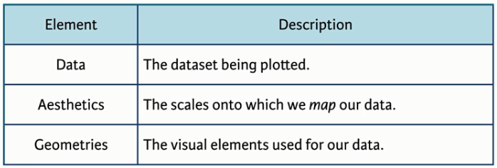
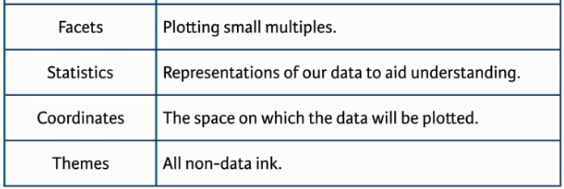
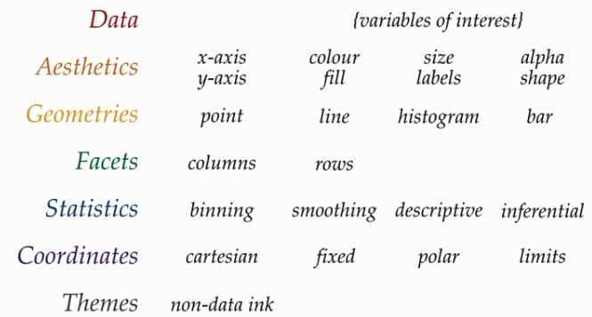

```{r setup, include=FALSE}
knitr::opts_chunk$set(echo = TRUE)  # This code enables this file to be used as a 'markdown' file
```

### Data Visualization with ggplot2
The R package ggplot2, this visualization package we will be using, is a data visualization package included with tidyverse.  To begin let's load the packages we will need to conduct data analysis and vizualization.
```{r library, echo=TRUE, results = 'hide', warning = FALSE, message = FALSE}
### Load data wrangling libraries ###
library(tidyverse)
library(skimr) # assists with summarizing ('skimming') your data
```

#### Layers
Visualizations in ggplot2 are constructed from 'layers'. There are three required layers - data, aesthetics, and geometries (Figure 1&ast;) - in order to create a visualization, and four optional layers that modify the visualization (Figure 2&ast;).

```{r image1, echo=FALSE, fig.cap="Figure 1. Required ggplot2 layers", out.width = '100%'}

```
```{r image2, echo=FALSE, fig.cap="Figure 2. Optional ggplot2 layers", out.width = '100%'}

```

##### Data layer
Let's start by familiarizing ourselves with our data.  First we need to get our data into R and join our data sets together.
```{r data, echo=TRUE}
#### read in data
# read in data
neus_data<-read_csv("data/neus_data.csv",guess_max = 16000) 
# get species data
spp<-read_csv("data/neus_svspp.csv") 
# get stratum data
strat<-read_csv("data/neus_svstrata.csv") 
# join species and stratum identification data to dataframe  
neus_data<-neus_data %>% 
  left_join(spp) %>%
  left_join(strat, by=c("STRATUM"="StratumCode"))
```

Let's explore what this data is, and start to understand it for ourselves. A useful way to quickly summarize all of the data in our 'tibble' is to use the `skim()` function. 

```{r data summary, echo=TRUE, warning=FALSE}
# summarize data
skim_with(integer = list(hist = NULL),numeric = list(hist = NULL)) #Suppress histograms
skim(neus_data)
```

Other useful functions for looking at a data frame are 'str()', 'glimpse()' and 'names()'.  To look at individual columns you may wish to use the 'class()', 'head()', 'unique()', and 'length()' functions, or some combination thereof.  e.g.,
```{r column summary, echo=TRUE}
# summarize data column
# BIOMASS; COMNAME (Common species name)
class(neus_data$BIOMASS); class(neus_data$COMNAME)
head(unique(neus_data$BIOMASS));head(unique(neus_data$COMNAME))
```
*Assign columns to individuals for short presentations to the classroom on each column.*

Once we know what our data is, we may wish to further explore our data by creating some exploratory plots. We likely aren't too concerned with the optional layers for this exploration, so let's focus on the required layers for now. The first required layer is the data, the table in which the data we wish to visualize is stored. This is the first argument to our visualization function 'ggplot()'.  I.E.,  'ggplot(data)'.  

If we only wish to look at the data from a single column we could use a bar or histogram geometry, e.g.,

```{r data explore, echo=TRUE}
# exploratory plots
ggplot(slice(neus_data,1:100),aes(COMNAME))+geom_bar()
ggdata<-sample_n(neus_data,10000)
ggplot(ggdata,aes(BIOMASS))+geom_histogram()
```

Recall that an aesthetics and geometry layer are required so you may note them in the examples.  If we only provide the data layer back into the biomass histogram what do we get?
```{r data explore2, echo=TRUE}
# exploratory plots
ggplot(ggdata)
```

##### Aesthetics layer
The second layer is our aesthetics layer. This is where we identify the scales onto which we want to display our data. This can be thought of as a projection similar to the mapping of geographic data, or the structure into which our data will be placed.  In essense we are defining the scaffolding that or visualization will be constructed in.  
Depending on the type of visualization you desire you may need a specific form of structure.  In the bar chart and histogram we created only a single variable was being plotted, so only one input to the aesthetics layer was provided.  If we add our aesthetics layer back in what do we get?
```{r data explore3, echo=TRUE}
# exploratory plots
ggplot(ggdata,aes(BIOMASS))
```

We can see the structure our data will be visualized with, but note that there is no data visualized.

If we were creating an 2d plot, e.g., a plot of x by y, our aesthetics layer would require a different structure, with an x and a y component.  For example, what will this give you? 
```{r data explore4, echo=TRUE}
# exploratory plots
ggplot(ggdata,aes(BIOMASS,ABUNDANCE))
```

This gives us a different structure for our 2d plot, but still no visualization.

##### Geometries layer
The third layer is our geometries layer. These are the visual elements that place our data into our aesthetic structure, such as bar charts, histograms, box-plots, etc. (Figure 3 &ast;, Geometries).

```{r image3, echo=FALSE, fig.cap="Figure 3. Example layer components", out.width = '100%'}

```

When you think about visualization the aspect you probably tend to think most about is what type of plot or visualization you want to create.  This is determined by the geometry layer, and where the standard, or baseline visualization options for ggplot2 live.  The R Studio ggplot2 cheat sheet contains a good summary of the geom options available. 
See: <https://www.rstudio.com/wp-content/uploads/2016/11/ggplot2-cheatsheet-2.1.pdf>

#### Combining layers to create a visualization.
These three layers are combined using the 'ggplot()' function to create a visualization. We give ggplot the data we want to plot, the aesthetic structure into which to place the data, and the visualization to use for that data.  When the layers are combined correctly we get our visualization.  For example, what will this give us?
```{r data explore5, echo=TRUE, warning=FALSE}
# exploratory plots
ggplot(ggdata,aes(BIOMASS,ABUNDANCE)) + geom_point()
```

If we try to visualize our data improperly - using a geometry without the correct structure to support it - we will get an error.  What happens if you try to run the following?

```{r data explore6, echo=TRUE, eval=FALSE, error=TRUE}
# exploratory plots
ggplot(ggdata,aes(BIOMASS)) + geom_point()
ggplot(ggdata,aes(BIOMASS,ABUNDANCE)) + geom_histogram()
```

In a sense creating a data visualization with ggplot2 is like creating an elaborate tiered layer cake.  If the supporting layer is incorrect your cake is likely to collapse. Our visualizations are constructed one layer at a time (Figure 4 &ast;), and the layers are combined with a '+'. The data and aesthetics layers are typically provided to the ggplot() function, and the geometry layer or layers follow.

```{r image4, echo=FALSE, fig.cap="Figure 4. Schematic of ggplot2 layering", out.width = '100%'}
knitr::include_graphics("images/Layer Viz.png")
```

Here we correctly supply our data layer, a 2d structure, and a geometry that works with that two variable structure:
```{r data viz exploration, echo=TRUE, warning=FALSE}
# plot two variables
ggdata2<-sample_n(ggdata,1000)
ggplot(ggdata2,aes(BIOMASS,ABUNDANCE)) +
  geom_jitter()
```

The beauty of ggplot2 is that as long as your structure is sound, you can add as many layers as you want to you cake.  For example, 

```{r data viz exploration2, echo=TRUE, warning=FALSE}
# plot two variables
ggplot(ggdata2,aes(BIOMASS,ABUNDANCE)) +
  geom_point() + geom_smooth(method=lm) + geom_rug()
```

In this case we provide our second geometry with additional input to smooth using a linear model.  As you can see on the cheat sheet some geometries can take, or expect, additional arguments.

*Select a geometry you wish to ulitize a create a visualization with it.*

Examples of addition layers...

For more information on using ggplot2, and a summary of the commands available for each layer see <https://ggplot2.tidyverse.org/reference/>.

&ast; Figures extracted from the DataCamp course Data Visualization with ggplot2 (Part 1)